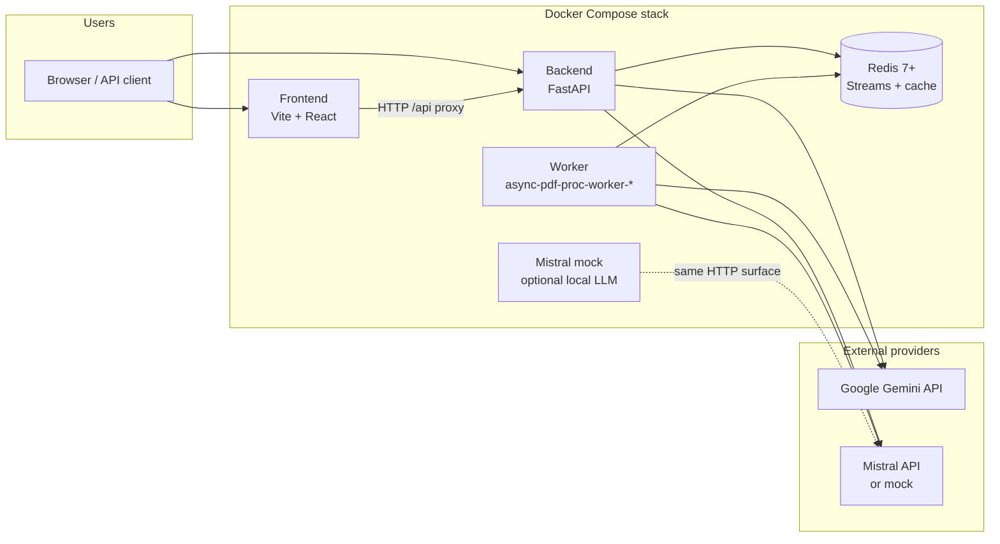
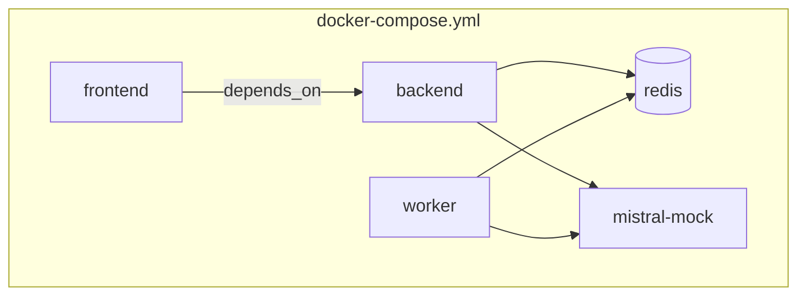
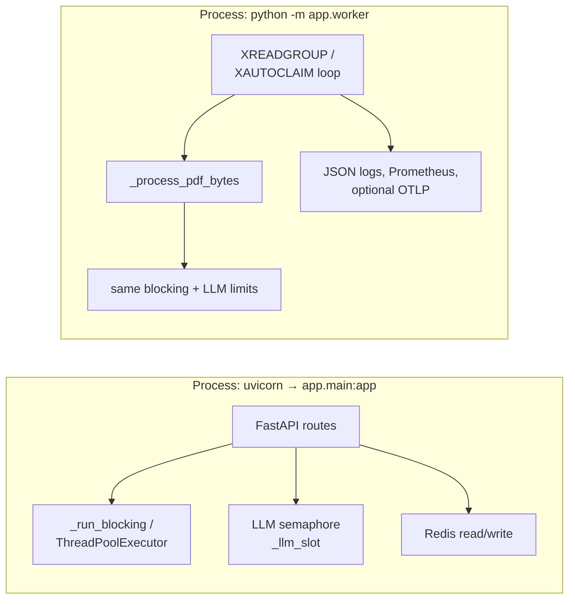
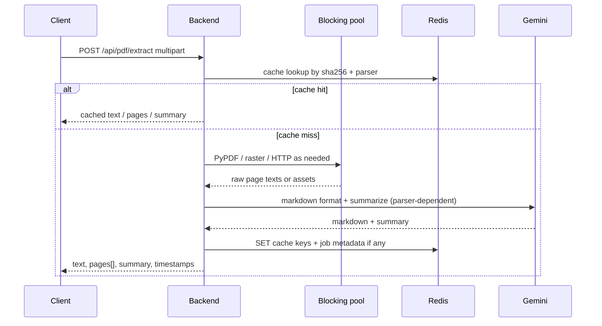
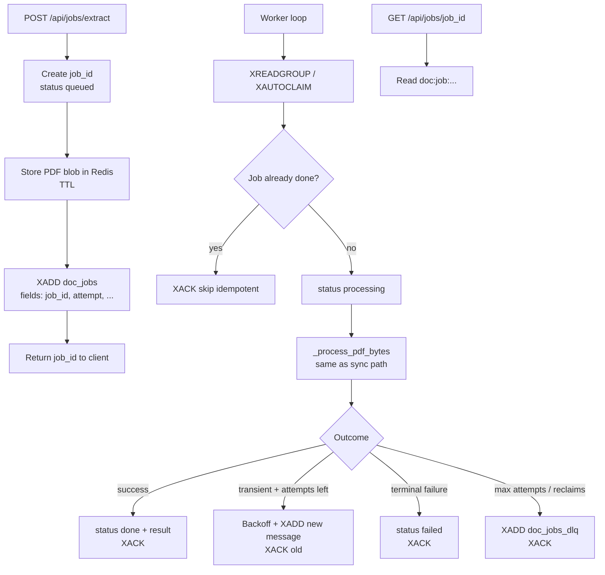
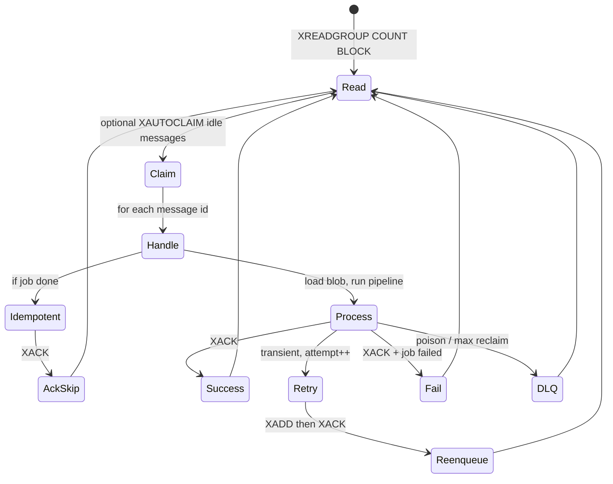
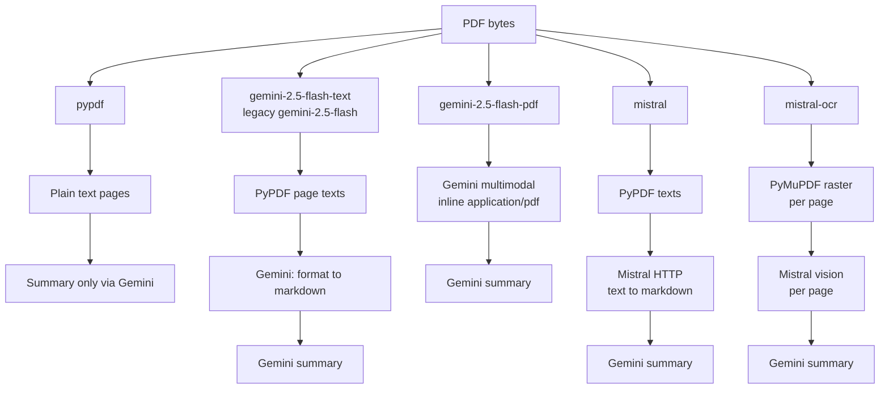
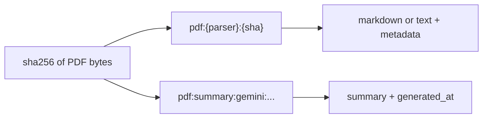
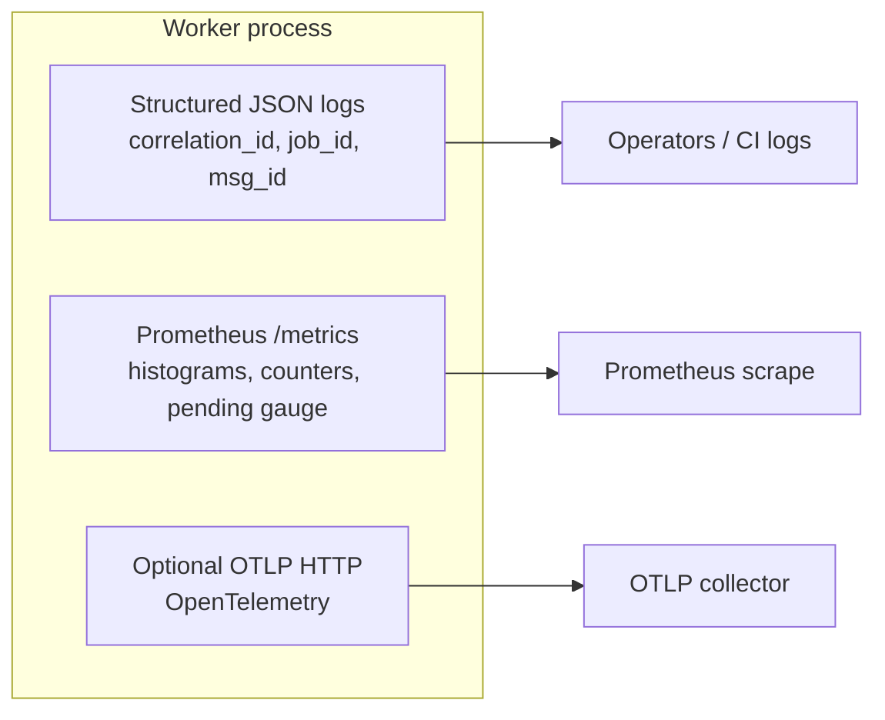
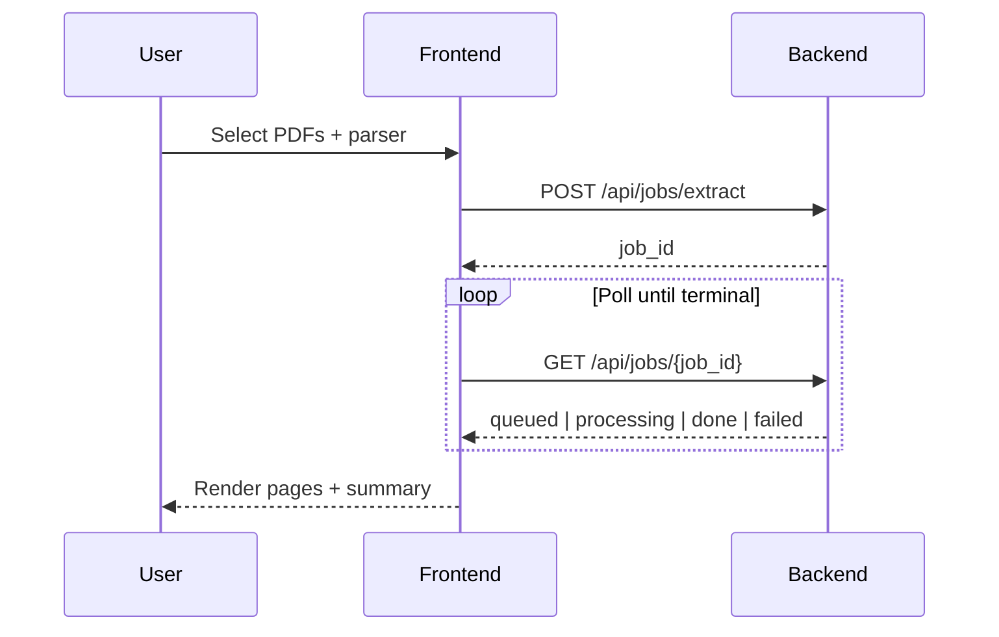

# Architecture

This document describes how **Async PDF Processor** is structured at runtime, how requests flow through the stack, and how asynchronous jobs use **Redis Streams**. For stream semantics (retries, `XACK`, DLQ), see [`STREAMS_CONTRACT.md`](STREAMS_CONTRACT.md).

---

## 1. System context

The application is a small **document ingestion and LLM-assisted extraction** system: users upload PDFs, choose a parser, and receive per-page text or markdown plus a **Gemini 2.5 Flash** summary per file. Processing may run **synchronously** in the API or **asynchronously** via a dedicated worker.

---

## 2. Containers and ports

| Service | Docker container name | Role | Default host port |
|--------|----------------------|------|-------------------|
| `frontend` | `async-pdf-proc-frontend` | React UI; dev server proxies `/api` to backend | `5173` |
| `backend` | `async-pdf-proc-backend` | FastAPI: health, sync extract, async job API, Gemini Q&A | `8000` |
| `worker` | `async-pdf-proc-worker-<n>` | Async consumer: `XREADGROUP` on job stream, metrics on `9464` (expose) | metrics only |
| `redis` | `async-pdf-proc-redis` | Job stream, consumer group, job state JSON, PDF blob staging, content cache | `6379` |
| `mistral-mock` | `async-pdf-proc-mistral-mock` | Local HTTP server mimicking Mistral chat for tests / no-key demos | `8001` |

---

## 3. Backend and worker processes

Both **backend** and **worker** are built from the same `backend/` image. They import shared logic from `app.main` (notably `_process_pdf_bytes`, Redis helpers, blocking executor, LLM slot semaphore).

**Why two processes?** The API stays responsive for uploads, polling, and health checks while long-running PDF and LLM work drains from the stream in the worker. Both paths enforce **bounded** blocking work and **capped** in-flight LLM calls (see `IMPLEMENTATION_STATUS.md`, PR-TR-1–PR-TR-5).

---

## 4. API surface (logical)

| Method | Path | Purpose |
|--------|------|---------|
| `GET` | `/api/health` | Liveness for stack / tests |
| `POST` | `/api/pdf/extract` | Synchronous multi-file extract + summary |
| `POST` | `/api/jobs/extract` | Enqueue async job (PDF bytes staged in Redis) |
| `GET` | `/api/jobs/{job_id}` | Poll job status and result |
| `POST` | `/api/gemini/answer` | Q&A over user text with optional language |

---

## 5. Synchronous extract flow

**Concurrency:** Multiple files in one request are processed with bounded parallelism (`SYNC_EXTRACT_MAX_CONCURRENT`). LLM steps acquire a global semaphore; saturation yields `503` + `Retry-After` or per-file errors depending on the route.

---

## 6. Asynchronous job flow (Redis Streams)

High-level stages: **enqueue → stream message → worker claims → process → job record → client polls**.

**Stream names (defaults):** `doc_jobs` (primary queue), `doc_jobs_dlq` (dead letter). **Consumer group:** `doc_workers`. Job state: Redis key `doc:job:{job_id}` (JSON).

---

## 7. Worker internal loop (simplified)

Exact ordering and policies are specified in [`STREAMS_CONTRACT.md`](STREAMS_CONTRACT.md).

---

## 8. Parser pipelines (conceptual)

All parsers converge on **per-page arrays** and a **single summary per file** (Gemini). Paths differ in how markdown is produced.

Oversized PDFs for the native Gemini PDF path return **413** (no silent fallback to text-only). See `README.md` and `docs/REQUIREMENTS.md` for parser IDs and env limits (`MISTRAL_OCR_MAX_PAGES`, etc.).

---

## 9. Caching and content addressing

Async jobs additionally use a **short-lived blob key** so the worker can fetch bytes after upload without holding large payloads in the stream payload itself.

---

## 10. Observability

---

## 11. Frontend integration

The Vite dev server proxies `/api` to the backend (`VITE_API_BASE_URL` in compose).

---

## 12. Scaling and failure modes

- **Scale workers:** `docker compose up --scale worker=N` (same consumer group). Idempotent `done` handling avoids duplicate side effects.
- **API vs worker LLM caps:** Both use the same slot model; tune `LLM_MAX_INFLIGHT` for combined cluster behavior.
- **Redis AOF:** Default compose command enables append-only file for durability of streams and keys (subject to Redis configuration).

---

## 13. Related documents

| Document | Topic |
|----------|--------|
| [`STREAMS_CONTRACT.md`](STREAMS_CONTRACT.md) | At-least-once delivery, `XACK`, retries, DLQ, reclaim |
| [`REQUIREMENTS.md`](REQUIREMENTS.md) | Formal FR/TR |
| [`IMPLEMENTATION_STATUS.md`](IMPLEMENTATION_STATUS.md) | What is implemented vs backlog |
| [`TESTS.md`](TESTS.md) | How integration tests assume a running stack |

---

**Async PDF Processor** — architecture overview for operators and contributors.
